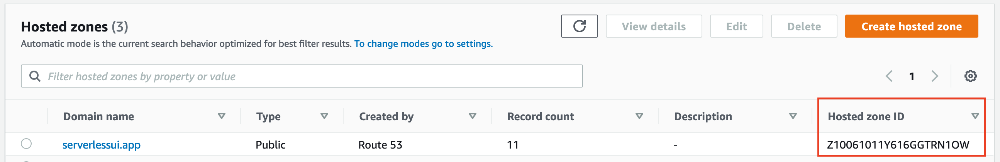
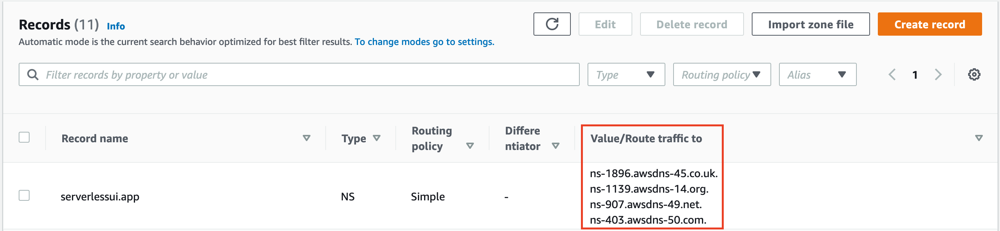
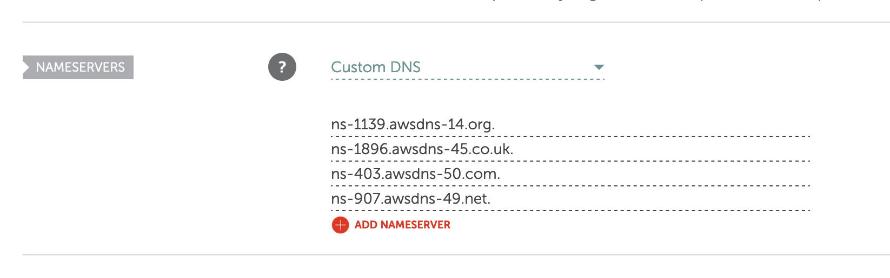

<p align="center">
    
</p>
<h1 align="center">
  Serverless UI
</h1>

<h3 align="center">
  💻 🚀 ☁ 
</h3>
<h3 align="center">
  Deploying Websites to AWS on Easy Mode
</h3>
<p align="center">
  Serverless UI is a free, open source command-line utility for quickly building and deploying serverless applications to AWS
</p>

- **Bring your own UI** Doesn't matter if it's React, Vue, Gatsby, or JQuery. If it compiles down to static files, then it is supported.

- **Serverless Functions** Your functions become endpoints, automatically. Serverless UI deploys your functions as Node.js lambdas behind a CDN and API Gateway for an optimal blend of performance and scalability.

- **Deploy Previews** Automatically deploy each iteration of your application with a separate URL to continuously integrate and test with confidence.

- **Custom Domains** Quickly configure a custom domain to take advantage of production deploys!

- **TypeScript Support** Write your serverless functions in JavaScript or TypeScript. Either way, they'll be bundled down extremely quickly with esbuild and deployed as individual Node.js 14 lambdas.

- **Own your code** Skip the 3rd Party services — get all of the benefits and security of a hosted AWS application, without going through a middleman. Deploy to a new AWS account, or an existing account and get up and running in five minutes!

## What’s In This Document

- [Get Up and Running in 5 Minutes](#-get-up-and-running-in-5-minutes)
- [CLI Reference](#-cli-reference)
- [Continuous Integration](#-continuous-integration)
- [FAQ](#-faq)
- [License](#license)

## 🚀 Get Up and Running in 5 Minutes

You can get a new Serverless UI site deployed to you AWS account in just a few steps:

1. **AWS Prerequisites**

   In order to deploy to AWS, you'll have to setup your machine with locally configured credentials. You'll find the best instructions [here](https://docs.aws.amazon.com/cli/latest/userguide/cli-chap-configure.html).

1. **Install the AWS CDK.**

   ```shell
   npm install -g aws-cdk
   ```

1. **Install the Serverless UI Command-Line Interface**

   ```shell
   npm install -g @serverlessui/cli
   ```

1. **Bootstrap your AWS Environment**

   Next, bootstrap the CDK environment for quicker subsequent deployments

   ```shell
   cdk bootstrap aws://ACCOUNT-NUMBER-1/REGION-1
   ```

1. **Deploy your static website**

   Next, tell the Serverless UI where to find your website

   ```shell
   sui deploy --dir="./dist"
   ```

## 📖 CLI Reference

1. [deploy](#deploy)
2. [configure-domain](#configure-domain)

### `deploy`

```shell
sui deploy
```

#### Options

|    Option     | Description                                        |     Default     |
| :-----------: | -------------------------------------------------- | :-------------: |
|    `--dir`    | The directory of your website                      |   `"./dist"`    |
| `--functions` | The directory of the functions to deploy           | `"./functions"` |
|   `--prod`    | Custom Domains only: `false` will deploy a preview |     `false`     |

> Note: The `--dir` directory should be only static files. You may need to run a build step prior to deploying

#### Examples

- Deploy a preview of static website in a `./build` directory with no functions

```shell
sui deploy --dir="./build"
...
❯ Website Url: https://xxxxx.cloudfront.net
```

- Deploy a preview of static website with serverless functions

```shell
sui deploy --dir="./build" --functions="./lambdas"
...
❯ Website Url: https://xxxxx.cloudfront.net
❯ API Url: https://xxxxx.cloudfront.net/api/my-function-name
❯ API Url: https://xxxxx.cloudfront.net/api/my-other-function-name
```

- Production deploy
  > Note: A custom domain must be configured for production deploys. See [configure-domain](#configure-domain)

```shell
sui deploy --prod --dir="./build" --functions="./lambdas"
...
❯ Website Url: https://www.my-domain.com
❯ API Url: https://www.my-domain.com/api/my-function-name
❯ API Url: https://www.my-domain.com/api/my-other-function-name
```

### `configure-domain`

This step only needs to be completed once, but it may take anywhere from 20 minutes - 48 hours to fully propogate

```shell
sui configure-domain [--domain]
```

#### Options

|   Option   | Description        | Default |
| :--------: | ------------------ | :-----: |
| `--domain` | Your custom domain |  None   |

#### Additional Steps

A minute or two after running this command, the deploy will "hang" while trying to validate the domain prior to creating the wildcard certificate.

1.  **Navigate to Route53**

    Find your Hosted Zone and take note of the Zone Id and Name Servers

    <p align="center">
        
    </p>
    <p align="center">
        
    </p>

2.  **Update the Nameservers on your Domain Registrar's website (eg. Namecheap)**

    <p align="center">
        
    </p>

3.  **Wait**

    The DNS resolution can be as quick as 10 minutes or take up to 48 hours. After some time, the Serverless UI command may timeout, but running it again should pick up where it left off.

4.  **Navigate to Certificate Manager**

    After the `configure-domain` command has completed successfully, navigate to Certificate Manager and take note of the Certificate Arn (eg. "arn:aws:acm:us-east-1:ACCOUNT_ID:certificate/xxxxxx-xxxx-xxxx-xxxx-xxxxxxxxxx")

5.  **Create a Serverless UI config file**

    Place the config file in the root of your project

    > serverless.config.js

    ```js
    module.exports = {
      domain: "serverlessui.app",
      zoneId: "Z10011111YYYYGGGRRR",
      certificateArn:
        "arn:aws:acm:us-east-1:ACCOUNT_ID:certificate/xxxxxx-xxxx-xxxx-xxxx-xxxxxxxxxx",
    };
    ```

## Continuous Integration

### GitHub Actions

```
name: Serverless UI Build & Deploy Preview

on: [pull_request]

jobs:
  deploy-pr-preview:
    runs-on: ubuntu-latest

    steps:
      - uses: actions/checkout@v2
      - name: Use Node.js
        uses: actions/setup-node@v1
        with:
          node-version: '12.x'
      - run: npm ci
      - run: npm run build
      - run: npm install -g @serverlessui/cli
      - run: npm install -g aws-cdk
      - name: Configure AWS Credentials
        uses: aws-actions/configure-aws-credentials@v1
        with:
          aws-access-key-id: ${{ secrets.AWS_ACCESS_KEY_ID }}
          aws-secret-access-key: ${{ secrets.AWS_SECRET_ACCESS_KEY }}
          aws-region: us-east-1
      - run: sui deploy --dir=./build
      - name: Add PR Comment
        uses: actions/github-script@v3
        with:
          github-token: ${{secrets.GITHUB_TOKEN}}
          script: |
            const manifest = require(`${process.env.GITHUB_WORKSPACE}/cdk.out/manifest.json`);
            const stackName = Object.keys(manifest.artifacts).find((key) =>
              key.startsWith("ServerlessUI")
            );
            const template = require(`${process.env.GITHUB_WORKSPACE}/cdk.out/${stackName}.template.json`);
            const baseUrlKey = Object.keys(template.Outputs).find((key) =>
              key.startsWith("ServerlessUIBaseUrl")
            );
            github.issues.createComment({
              issue_number: context.issue.number,
              owner: context.repo.owner,
              repo: context.repo.repo,
              body: `✅ Your deploy preview is ready: ${template.Outputs[baseUrlKey].Value}`,
            });
```

## FAQ

- Q. How is this different than Netlify or Vercel?
  - Serverless UI allows you to enjoy the benefits of pre-configured infrastructure without going through a middleman. This allows for fewer accounts, tighter security and seamless integration with a wealth of AWS services. Additionally, you receive these benefits "at cost" since this is deployed directly to your AWS account.

## License

Licensed under the [MIT License](./LICENSE).
